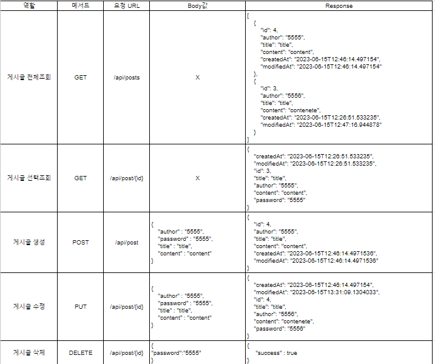
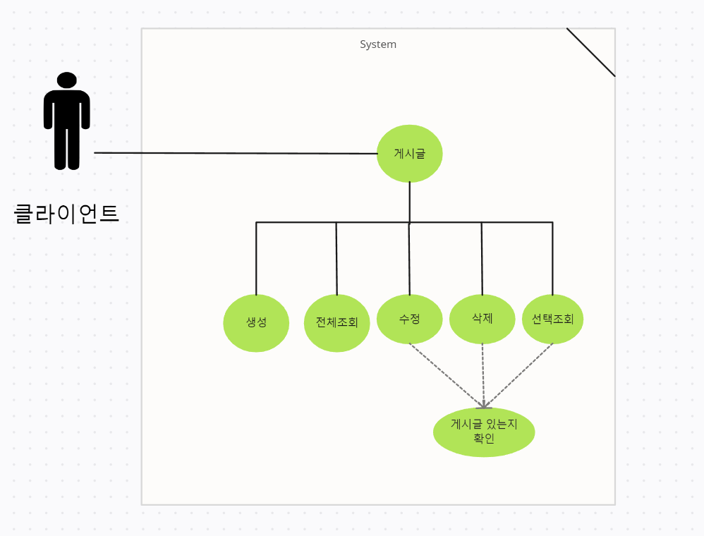

1. 수정, 삭제 API의 request를 어떤 방식으로 사용하셨나요? (param, query, body)
- 수정 과 삭제할 게시글의 번호는 param으로 받았고 비밀번호와 수정할 내용은 body을 통해 받아왔습니다. body를 통해 데이터를 받은 이유는 비밀번호와 게시글의 수정사항중 노출이 되면 안되는 내용이 포함되어있기 때문에 Body로 받았습니다.
2. 어떤 상황에 어떤 방식의 request를 써야하나요?
- 조회 GET, 생성 POST, 전체 수정 PUT, 부분 수정 PATCH, 삭제 DELETE 
3. RESTful한 API를 설계했나요? 어떤 부분이 그런가요? 어떤 부분이 그렇지 않나요?
- 전체의 API가 그렇다고 생각합니다.
4. 적절한 관심사 분리를 적용하였나요? (Controller, Repository, Service)
- 잘 적용했다고 생각합니다.
5. API 명세서 작성 가이드라인을 검색하여 직접 작성한 API 명세서와 비교해보세요!
- 직접 작성한 API 명세서

6. Use Case
